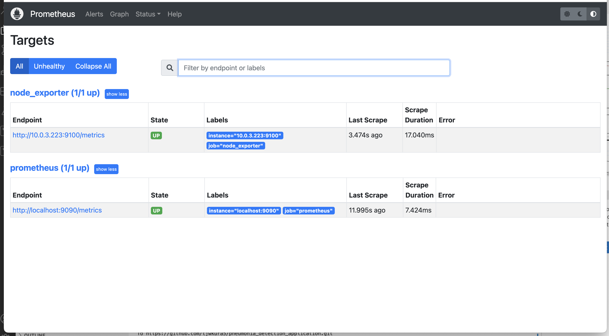
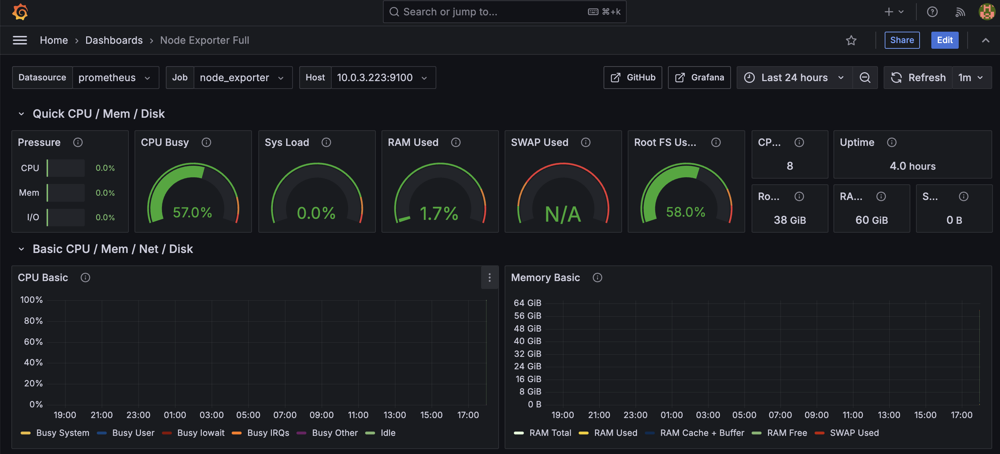
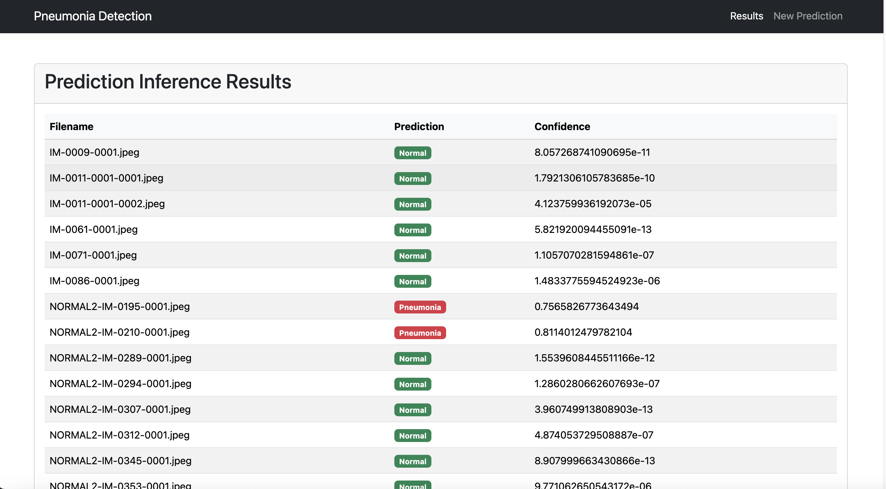
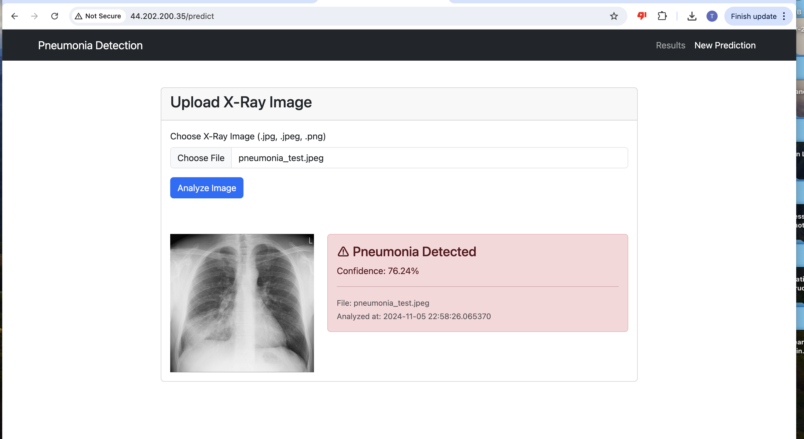

# Pneumonia Detection Application

## Purpose

In this workload, we are tasked with creating and optimizing the infrastructure for a neural network application that assists doctors in diagnosing pneumonia from X-ray images. The goal is to ensure that the infrastructure is robust, secure, and efficient while addressing key issues in model performance. To achieve this, we focus on three core areas:

**Infrastructure Modernization and Security:**  
* We are transitioning the application from a public subnet to a more secure private subnet, ensuring that sensitive data and application services are protected. This involves leveraging Nginx, deployed on a public subnet, to function as a reverse proxy, managing traffic securely and efficiently between external clients and the backend application.

**Monitoring and Observability:**  
* To ensure that the infrastructure operates smoothly and to quickly detect any issues, we are configuring Prometheus and Grafana for real-time monitoring. Prometheus will collect key metrics from the infrastructure and the application, while Grafana will be used to visualize these metrics in an accessible and actionable way, enabling proactive management and troubleshooting.

**Model Performance Improvement:**  
* We are addressing model accuracy concerns, specifically the bias that causes the application to over-predict pneumonia. This involves identifying the sources of bias in the model's training data and implementing strategies to mitigate these biases, thereby improving the model's reliability and making it more useful for clinical decision-making.

Let's get Started! 

## Steps

### Set up Development Environment
   - Spin up a `t3.medium` instance in your AWS account’s VPC.
   - Install **Terraform** (**VSCode** is optional but recommended).
   
### Clone and Prepare Repository
   - Clone the project repository and upload it to your own GitHub account.
   - Update any file references to the repository URL to point to your new GitHub repository.

### Key Pair Creation

**Create a key pair** called `mykey` in your AWS account. This will allow you to SSH into the instances in the private subnets for configurations. We want to create the the RSA key pair in AWS so that we can download and have access to the .pem file that we will be using to SSH into those instances. You can choose to scp the .pem file from your local machine to one of your instances in the public subnet or you can add the .pem file dynamically through your terraform code.

### Create Infrastructure 

In my terraform configuration I am setting up a machine environment in AWS, including a VPC with both public and private subnets, an internet and NAT gateway, security groups, and several EC2 instances for different purposes (e.g., Nginx, Monitoring, UI, application, and training server).

### Improving The Models Accuracy

Our model is a ResNet50 (Residual Network with 50 layers) model which is a type of deep convolutional neural network (CNN) architecture used primarily for image classification tasks. The issue with our original model was that it was over predicting pneumonia so we employed several strategies to reduce overfitting.

**Layer Configuration and Regularization**
   - **L2 Regularization**: Added to dense layers to prevent overfitting by penalizing large weights.
   - **Batch Normalization**: Helps to stabilize and speed up training by normalizing the output of each layer.
   - **Dropout**: Introduced after dense layers to randomly deactivate neurons during training, reducing overfitting.


```python
from tensorflow.keras.layers import Dropout, BatchNormalization
from tensorflow.keras.regularizers import l2
from tensorflow.keras.layers import Activation

# Add classification layers
x = base_model.output
x = GlobalAveragePooling2D()(x)  # Reduces the 7x7x2048 output to 2048

x = Dense(256, kernel_regularizer=l2(0.001))(x)  # Dense layer with L2 regularization
x = BatchNormalization()(x)  # Batch normalization
x = Activation('relu')(x)  # ReLU activation
x = Dropout(0.3)(x)  # Dropout to prevent overfitting

x = Dense(256, kernel_regularizer=l2(0.001))(x)  # Another dense layer with L2 regularization
x = BatchNormalization()(x)  # Batch normalization
x = Activation('relu')(x)  # ReLU activation
x = Dropout(0.3)(x)  # Dropout
```

**Fine-Tuning**
   - **Unfreezing Layers**: The top 15 layers of the ResNet50 model are unfrozen, allowing them to be trained specifically on the pneumonia X-ray dataset. This enables the model to adapt better to the task.

```python
# Unfreeze the top 15 layers in the ResNet50 base model
for layer in base_model.layers[-15:]:
    layer.trainable = True  # Set the layers to be trainable
```

**Learning Rate Schedule with Exponential Decay**
   - **Exponential Learning Rate Decay**: The learning rate starts small and decays over time, allowing the model to learn gradually and avoid overshooting during training.

```python
# Define the initial learning rate and exponential decay schedule
initial_learning_rate = 1e-5  # Start with a very small learning rate
lr_schedule = tf.keras.optimizers.schedules.ExponentialDecay(
    initial_learning_rate=initial_learning_rate,
    decay_steps=10000,  # Decay every 10,000 steps
    decay_rate=0.95,  # Reduce learning rate by 5% at each decay
    staircase=True  # Decay in discrete steps
)

# Compile the model with the learning rate schedule
model.compile(
    optimizer=tf.keras.optimizers.Adam(learning_rate=lr_schedule),
    loss='binary_crossentropy',
    metrics=['accuracy']
)
```

**Data Augmentation Enhancements**
   - The augmentation strategy is more aggressive, incorporating **zoom**, **width/height shifts**, and **rotation**. This improves the model’s robustness to variations in the input data.

```python
train_datagen = ImageDataGenerator(
    rescale=1./255,
    rotation_range=15,
    width_shift_range=0.3,
    height_shift_range=0.3,
    horizontal_flip=True,
    zoom_range=0.2,  # Added zoom for better variance in the training data
    fill_mode='nearest'  # Ensures pixels outside the boundary are filled
)
```

**Enhanced Callbacks:**
   - **EarlyStopping**: This callback has a longer patience setting, allowing the model more time to learn before halting.

```python
callbacks = [
    EarlyStopping(monitor='val_loss', patience=5, restore_best_weights=True),
    ModelCheckpoint('best_model.keras', monitor='val_accuracy', save_best_only=True),
    # Reduce learning rate if validation loss plateaus
    # ReduceLROnPlateau(monitor='val_loss', factor=0.1, patience=3, min_lr=1e-7)
]
```

**Class Weights for Imbalanced Data**

- **Class Weights**: To handle imbalanced data, weights are added to the classes to give more importance to the underrepresented class (e.g., pneumonia).

```python
# Compute class weights to address class imbalance
class_weights = {0: 1.1, 1: 1.4}  # Adjust weights to give more importance to pneumonia class

# Train the model with class weights
history = model.fit(
    train_dataset,
    steps_per_epoch=train_generator.samples // train_generator.batch_size,
    epochs=15,  # Adjust epochs as needed
    validation_data=val_dataset,
    validation_steps=math.ceil(val_generator.samples / val_generator.batch_size),
    class_weight=class_weights,  # Add class_weight here
    callbacks=callbacks
)
```

The enhancments that we made to our model resulted in a 89 percent overall accuracy based on results from testing. 


### Monitoring Server Setup

**Connect to the Monitoring Server**.
   - Navigate to `/opt/prometheus/prometheus.yml`.
   - Under `scrape_configs`, add the following:
     ```yaml
     - job_name: 'node_exporter'
       static_configs:
     - targets: ['${ML_TRAINING_SERVER_IP}:9100']
     ```
   - In the terminal, execute:
     ```
     sudo systemctl restart prometheus
     ```
Make sure Prometheus and Grafana are configured correctly to grab information from the node exporter on the Application Server. 





### Nginx Server Configuration

**Connect to the Nginx Server**.
   - Navigate to `/etc/nginx/sites-enabled/default`.
   - After the server listen configuration, add the following (replace `{UI_SERVER_IP}` with UI server IP):
     ```nginx
     location / {
         proxy_pass http://${UI_SERVER_IP}:5001;
         proxy_set_header Host $host;
         proxy_set_header X-Real-IP $remote_addr;
         proxy_set_header X-Forwarded-For $proxy_add_x_forwarded_for;
         proxy_set_header X-Forwarded-Proto $scheme;
     }
     ```
   - In the terminal, execute:
     ```
     sudo systemctl restart nginx
     ```
Make sure that Nginx routes traffic correctly. 

### Application Server Setup Part 1

**SSH into the Application Server**.
   - Execute:
     ```
     sudo reboot
     ```
   - After connecting again, in `/etc/redis/redis.conf`, modify these lines:
     ```
     bind 0.0.0.0
     protected-mode no
     ```
   - Run the following commands in the terminal:
     ```
     sudo systemctl restart redis

### ML Training Server Configuration

**Exit the Application Server and SSH into the ML Training Server**.
   - Navigate to `CNN_deploy/model/inference.py` and put the private IP of the Application Server where it says `backendapi_private_ip`. This way when we run inference.py the results can be stored in our redis database which is running on port 6379 in our application server. 

   - In the terminal, execute the following commands:
     ```
     sudo reboot
     #### connect again ####
     cd CNN_deploy/model
     git pull 
     python3 -m venv venv
     source venv/bin/activate
     pip install --upgrade pip
     pip install -r requirements.txt
     python3 cnn.py
     python3 inference.py
     ```
   - Move the model (`best_model.keras`) to the application server by adding your `mykey.pem` and using SCP:
     ```
     scp -i ~/.ssh/mykey.pem /home/ubuntu/CNN_deploy/model/best_model.keras ubuntu@10.0.2.162:/home/ubuntu/CNN_deploy/pneumonia_api
     ```
Make sure that the saved model (post-training) is accessible in the Application Server for Redis.

### Application Server Final Setup

**Exit the ML Training server and SSH back into the Application Server**.
   - Execute:
     ```
     cd ~/CNN_deploy/pneumonia_api
     python3 -m venv venv
     source venv/bin/activate
     pip install -r requirements.txt
     nohup gunicorn --bind 0.0.0.0:5000 app:app &
     exit 
     ```
Make sure that the application api is up. 

### Frontend Server Configuration

**Exit the ML Training Server and SSH into the UI Server**.
   - Navigate to `CNN_deploy/pneumonia_web/app.py` and replace `API_URL` with the private IP of the Application Server.
   - In the terminal, execute:
     ```
     sudo reboot
     #### connect again ####
     cd ~/CNN_deploy/pneumonia_web
     python3 -m venv venv
     source venv/bin/activate
     pip install -r requirements.txt
     nohup gunicorn --config gunicorn_config.py app:app &
     exit
     ```

Once you have started your front end app you should be able to copy and past the public IP address from your nginx server and see the app running:

**Inference Results in Redis**



**Analyzing an Image**



## Troubleshooting

### Generator Data Type Issue 

```
INVALID_ARGUMENT: TypeError: generator yielded an element that did not match the expected structure. The expected structure was (tf.float32, tf.float32, tf.float32), but the yielded element was (array([[[[0.15735129, 0.15735129, 0.15735129],
         [0.15362512, 0.15362512, 0.15362512],
         [0.1570118 , 0.1570118 , 0.1570118 ],
         ...,
         [0.3605814 , 0.3605814 , 0.3605814 ],
         [0.3597184 , 0.3597184 , 0.3597184 ],
         [0.35885546, 0.35885546, 0.35885546]],

        [[0.17166445, 0.17166445, 0.17166445],
         [0.16779038, 0.16779038, 0.16779038],
         [0.15369645, 0.15369645, 0.15369645],
         ...,
         [0.35728568, 0.35728568, 0.35728568],
         [0.35814866, 0.35814866, 0.35814866],
         [0.35901162, 0.35901162, 0.35901162]],

        [[0.1597264 , 0.1597264 , 0.1597264 ],
         [0.14237627, 0.14237627, 0.14237627],
         [0.13117054, 0.13117054, 0.13117054],
         ...,
         [0.36142722, 0.36142722, 0.36142722],
         [0.3622902 , 0.3622902 , 0.3622902 ],
         [0.36315316, 0.36315316, 0.36315316]],

        ...,
```

I encountered the preceding error when moving from Google Colab to attempting to train and run our model on our P3 instance. The error indicates that the structure of the data generated by our generator doesn’t match the expected input shape for the model. The model expects (tf.float32, tf.float32, tf.float32). The solution was to cast the input data to tf.float32: 

```
def convert_to_float32(images, labels):
    return tf.cast(images, tf.float32), labels

train_dataset = tf.data.Dataset.from_generator(
    lambda: train_generator,
    output_signature=(tf.TensorSpec(shape=(None, 224, 224, 3), dtype=tf.float32),
                      tf.TensorSpec(shape=(None,), dtype=tf.float32))
).map(convert_to_float32)

val_dataset = tf.data.Dataset.from_generator(
    lambda: val_generator,
    output_signature=(tf.TensorSpec(shape=(None, 224, 224, 3), dtype=tf.float32),
                      tf.TensorSpec(shape=(None,), dtype=tf.float32))
).map(convert_to_float32)

test_dataset = tf.data.Dataset.from_generator(
    lambda: test_generator,
    output_signature=(tf.TensorSpec(shape=(None, 224, 224, 3), dtype=tf.float32),
                      tf.TensorSpec(shape=(None,), dtype=tf.float32))
).map(convert_to_float32)
```

## System Diagram


## Optimization

### More Fine Tuning

I'm pretty happy with an 89% overall accuracy, but in the next iteration of this application, I would like to improve the model's overall accuracy to above 95%. To achieve this, I would experiment with the following strategies:

**More Training Data:** Collect additional labeled X-ray images, especially focusing on underrepresented classes, to enhance the model's ability to learn diverse features.

**Cross-Validation:** Use k-fold cross-validation to ensure the model's performance is robust across different subsets of the data.

**Ensemble Methods:** Combine multiple models through techniques like model averaging or stacking to boost accuracy by leveraging different model strengths."


### Exploring Other Models

We can explore the prospect of using different models that may yield a better accuracy. One example is: 

**DenseNet**
   - **Description**: DenseNet connects each layer to every other layer in a dense block, which leads to feature reuse and better gradient flow. DenseNet models (e.g., DenseNet121) are known for achieving great results on medical imaging tasks.
   - **Advantages**: Efficient use of parameters, improved gradient flow, and high accuracy in many image classification tasks.
   - **Use case**: Particularly effective for medical image classification, including X-ray image analysis.

### More Automation

The steps for configuring our infrastructure were fairly manual. Our setup can benefit from utilizing a CI/CD pipeline and increasing automation by adding additional commands to our user data scripts. These commands could include adding missing IP addresses to configuration files, training and testing our model, copying the Keras file to our app server, and running our apps.

## Conclusion

In this project, we successfully modernized and optimized the infrastructure for a pneumonia detection application powered by machine learning. By transitioning to a secure and scalable AWS environment, we ensured the application runs on private subnets with Nginx as the reverse proxy. With the integration of Prometheus and Grafana, we established a robust monitoring system that provides real-time insights into the application's performance.

On the model side, we tackled the issue of overfitting by implementing regularization techniques, fine-tuning the pre-trained ResNet50 model, and employing advanced strategies like data augmentation and learning rate scheduling. These improvements led to a significant enhancement in the model's performance, achieving an overall accuracy of 89%.

We also set up a complete pipeline from model training to deployment, involving configuring EC2 instances, setting up Redis for storing inference results, and ensuring seamless interaction between the frontend and backend components of the system. 

With the system now operational, doctors at Mount Sinai Hospital can leverage the pneumonia detection model to assist in diagnosing pneumonia from X-ray images, contributing to better healthcare outcomes
